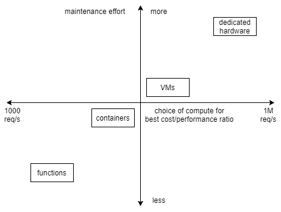

# Introduction

There are certain deficiencies in the current cloud ecosystem that make it difficult to use the cloud ecosystem as a cohesive programming environment. These are several improvements across language, tooling and runtime that can make the interface to the cloud much more robust.

## Constraint based programming [^1]

A common use case in building cloud applications is choosing and configuring the compute layer that actually runs the application logic. Making this decision is not easy as it depends on some of the following factors - cost, performance, maintainence overhead, security.

For example when creating a user facing API backed by a database. These are the following choices for compute available (roughly) -

* Functions as a Service (e.g. AWS Lambda or Azure Functions) - All application logic is run in independent functions that can communicate with each other or are orchestrated by a separate servic (like state function). The application logic behaves like a large state machine distributed across multiple compute nodes.
* Kubernetes or any Docker container orchestrator - In this case the entire application logic is bundled as single running process but it is packaged as a docker conatiner that can be orchestrated by a layer like kubernetes.
* VM image - In this case the application logic is bundles as bundled as an OS image with all dependencies are and requirements right from the os up. The orchestration is handled by load balancers and auto-scaling groups.

The following diagram represents a rought gradient of choices that can be taken.

The idea is that runtime system should choose the specific implementation based on user defined constraints.

## Automated least priviledge security [^4]

A common theme across cloud provider is ensuring least priviledge access to various entities. This is done by giving permissions for various APIs to a role and then attaching this role to a user or compute instance which makes the API calls.

In this context least priviledge means giving an entity only the required permissions for it to perform it's actions. Currently this is process of deciding required permissions is completely manual and extremely tedious and error prone.

The main reasoning behind this is that erroneous or malicious changes outside the scope of the application are rendered impossible. Since most cloud providers give access to runtime systems that can run arbitrary code. A system with extra priviledges can potentially be used as an avenue for attacking the other parts of the organizations IT infrastructure.

A better cloud declaration language/SDK would automatically be able to generate the required permissions based by analyzing the API calls in the application code.

There are a few subtle challenges here -
* Balancing parameterized generic policies vs completely declared policies (monomorphization) with readability of policies
* Creating permissions policies that can change their own permissions i.e. roles that have permissions to change e.g pipeline to deploy applications.

## Simulating systems [^2] [^3]

It's difficult to model the performance cloud application that is composed of multiple distributed components. Usually this can only be done using historical metrics and logging. Which means performance bottlenecks and potential throttling issues can only be detected when they occur (or you know someone with prior experience).

Another issues is that a cloud application behaves like a large state machine it becomes difficult to detect subtle concurrency issues across multiple components.

Furthermore calculating cost of running a cloud application is a difficult problem. This happens because cost structure by cost providers is very granular (upto per request or per GB consumed cost). This means that the cost to a large extent depends on the data flow/access pattern rather than the actual components involved.

All three problems are inter-related because they point to the lack of simulation tools for cloud applications. Currently most of these properties can only be determined by running the whole system which is costly and error prone.

Programming systems that can do the following offer potential solutions to these problems.

* Declare invariants and data flow across multiple nodes and simulate the application on a local (multi-threaded/multi-process) machine while checking if invariants are being met and further directly derive [implementation from specification](#constraint-based-programming) based on constraints.
* Perform data flow analysis and also include performance characteristics of various components to identify bottlenecks.
* Allow using a data trace or sample user inputs to simulate application and approximate cost with greater fidelity.

## Changing database schema at compile time [^5]

Let's consider a platform that receives data from many IoT devices. IoT devices have many models and different models send data with different fields. Generally these are stored in blob/nosql storage, a separate operation scans this storage for changes in schema.

Usually the changes in schema are additive only that is new fields in a new piece of data are added to schema. All records not having these fields automatically have these as `null` values.

The problem here is that the schema is generated and stored separately and not as part of the application code that will interact with the data. This means that either the schema has to be copied by hand or is only accessible at runtime. This significantly reduces the kind of validations that can be performed at runtime.

# Discussing the solution

All the above features point towards creating a language more suited towards the challenges for programming for the cloud. Such a language might have some of the following features.

1. Types with performance, availability and similar "auxiliary" properties. Any component is composed a few core types and inherits from their auxiliary properties.
2. Type checker can check types for auxiliary property related constraints.
3. All external API calls can be modelled as effects, making it possible to derive the permission policy required by the program.
4. Core network, storage APIs are defined and have polymorphic implementations to support production deployment, single threaded simulation, multi-threaded simulation etc. [^3]
5. One of the stages in the compilation process will be  an intermediate representation that is a human readable DSL allowing for specific optimizations or changes. [^2]

# References

* [^1]: [New direction in Cloud programming](http://cidrdb.org/cidr2021/papers/cidr2021_paper16.pdf)  
* [^2]: Design and implementation of [AWS CDK](https://github.com/aws/aws-cdk)  
* [^3]: [Protocol combinators](https://ilyasergey.net/assets/pdf/papers/dpc-jfp.pdf)  
* [^4]: [Zelkova](https://www.cs.utexas.edu/users/hunt/FMCAD/FMCAD18/papers/paper3.pdf) can create permission policies based on historical usage patterns. It's still missing a way to generate policy by statically analyzing code.  
* [^5]: Discussions with [@ajit-kolathur](https://github.com/ajit-kolathur)  
